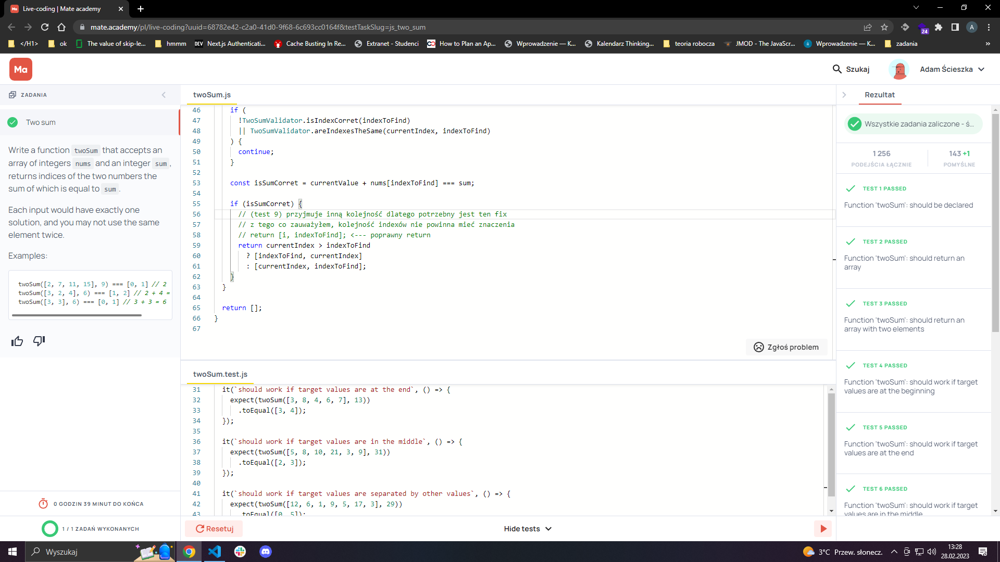

# solutions

Prove of concept

### code after 15mins during interview in `twoSum-duringInterview.js`

I had missed that I misused `find` instead of `findIndex` which I couldn't find during the interview

### code after interview in `twoSum-afterInterview.js`

After some corrects, final touches rest of the tests cases were respected but I couldn't find the most efficient way to aggregate mismatches in `findIndex`

### code after interview with research (outside help - mr. google) `twoSum-withCorrects.js`
